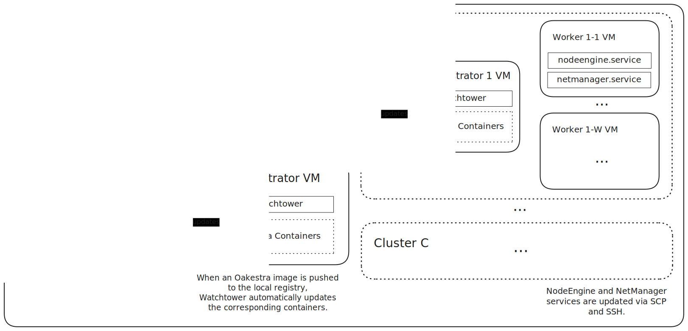

# Oakestra Terraform Setup for Local Deployment

This repository contains a Terraform project for deploying a local Oakestra setup for development and testing purposes. 
The deployment uses local virtual machines via libvirt.

## Prerequisites

Before you begin, ensure you have the following installed and configured:

1. **Firmware Setup** 
   * Enable hardware virtualization in your BIOS/Firmware for KVM.
2. **Required Tools**
   * [Terraform](https://www.terraform.io/downloads.html) or [OpenTofu](https://opentofu.org/)
   * [libvirt](https://libvirt.org/) (e.g., with QEMU backend)
3. **User Privileges**
   * Add your user to the libvirt group:
     * `$ sudo usermod -a -G libvirt $USER`
     * reboot or `$ newgrp libvirt`
4. **Libvirt Configuration**
   * In file `/etc/libvirt/network.conf`
   * Add or uncomment line with `firewall_backend = "iptables"`.
   * `$ systemctl restart virtnetworkd`

## Quick Start Guide

1. **Clone this Repository**
2. **Configure Variables**:
   * Create a `.tfvars` file to customize your deployment (e.g. `oakestra.tfvars`).
3. **Initialize Terraform**:
   * `$ terraform init`
4. **Deploy the Infrastructure**:
   * `$ terraform apply -var-file="oakestra.tfvars"`

## Interacting with the Setup

After deployment, Terraform will generate a Bash script at `${XDG_DATA_HOME}/oakestra-dev/<setup-name>/activate`
(e.g. `~/.local/share/oakestra-dev/oaks-1000/activate`). 
Sourcing this script (e.g. `$ source ~/.local/share/oakestra-dev/oaks-1000/activate`) will make a few bash functions
available that allow interacting with the cluster:
- **`<setup-name>-ssh`**:
  - Connect to any virtual machine of the setup.
  - Naming scheme of the virtual machines (with indices starting at one):
    - Root Orchestrator: `root-orc`
    - Cluster Orchestrator C: `cluster-orc-<C>` 
    - Worker W (in Cluster C): `worker-<C>-<W>` 
  - Examples:
    - `$ oaks-1000-ssh root-orc`
    - `$ oaks-1000-ssh cluster-orc-1`
    - `$ oaks-1000-ssh worker-2-1`
- **`<setup-name>-image-push`**:
  - Pushes a container image to the setup, replacing affected, running containers automatically.
  - The host/port and version parts of the image name don't matter, just the actual name has to match.
  - Examples:
    - `$ oaks-1000-image-push oakestra/oakestra-net/root-service-manager:development`
    - `$ oaks-1000-image-push ghcr.io/oakestra/oakestra-net/root-service-manager:v0.4.400`
- **`<setup-name>-nodeengine-push`**
  - Updates and restarts the `nodeengine` service on all worker nodes.
  - Example: `$ oaks-1000-nodeengine-push ./NodeEngine_amd64 ./nodeengined_amd64`
- **`<setup-name>-netmanager-push`**
  - Updates and restarts the `netmanager` service on all worker nodes.
  - Example: `$ oaks-1000-netmanager-push ./amd64-NetManager`

## Architecture

